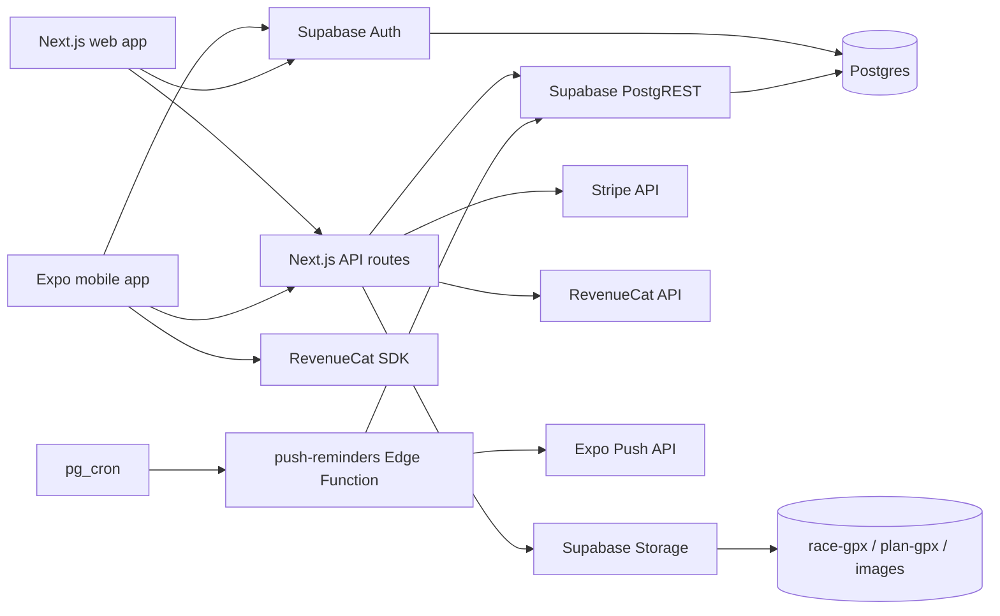

# Architecture Overview

## Purpose

This document gives the high-level map of the Pace Yourself monorepo. Use it to understand the app boundaries before changing code, migrations, or shared packages.

## Key Concepts

- Monorepo: one repository with web, mobile, and package workspaces.
- Web app: Next.js application deployed with Vercel settings.
- Mobile app: Expo Router application built through EAS profiles.
- Backend: Supabase Auth, Postgres, Storage, Edge Functions, and pg_cron.
- Shared logic: local packages used by both app surfaces where possible.

## Stack Summary

Pace Yourself uses npm workspaces declared in `package.json`. The workspace roots are:

- `apps/web`
- `apps/mobile`
- `packages/*`

Turbo is configured in `turbo.json` with `build`, `dev`, `typecheck`, `lint`, and `test` tasks. Build outputs include `.next/**` and `dist/**`.

The web app is a Next.js 14 app:

- Source: `apps/web`
- Config: `apps/web/next.config.mjs`
- Framework dependency: `next ^14.2.5`
- React dependency: `react ^18.3.1`
- Supabase dependencies: `@supabase/supabase-js ^2.45.4`, `@supabase/ssr ^0.5.0`
- Analytics dependencies: `posthog-js`, `posthog-node`, `@vercel/analytics`, `@vercel/speed-insights`

The mobile app is an Expo Router app:

- Source: `apps/mobile`
- Config: `apps/mobile/app.config.ts`
- EAS profiles: `apps/mobile/eas.json`
- Expo SDK: `expo ~54.0.33`
- React Native: `react-native 0.81.5`
- React: `react 19.1.0`
- Supabase dependency: `@supabase/supabase-js ^2.45.4`
- Native billing dependency: `react-native-purchases ^9.15.1`
- Native analytics dependency: `posthog-react-native ^4.45.0`

## Monorepo Structure

```text
apps/
  web/          Next.js app, API routes, web planner, admin, auth/session routes.
  mobile/       Expo Router app, mobile onboarding, catalog, plan and push flows.
packages/
  design-system/ Shared tokens, fonts, and signature icons.
  shared/        Shared alert scheduling and plan utility logic.
  tanstack-react-query/ Local package shim for React Query imports.
  fuel-planner/  Fuel plan computation source used as a local logic module.
supabase/
  migrations/    SQL migrations and pg_cron setup.
  functions/     Supabase Edge Functions for push registration/reminders.
  tests/         Manual SQL RLS checks.
docs/
  _archive/      Previous docs moved unchanged.
```

## Deployment Topology

The web app is configured for Vercel in `vercel.json`. It declares:

- `framework: "nextjs"`
- `buildCommand: "npm run build"`
- `installCommand: "npm install --legacy-peer-deps"`
- `outputDirectory: ".next"`
- redirects from `trailplanner.app` and `trail-planner.vercel.app` to `https://pace-yourself.com/:path*`

The mobile app is configured for EAS in `apps/mobile/eas.json`:

- `development`: internal distribution with `developmentClient: true`
- `preview`: internal distribution, Android APK, iOS Release build
- `production`: Android app bundle, iOS Release build, remote app version source

Supabase provides:

- Auth sessions used by both web and mobile.
- Postgres tables described in [../02-database/schema-overview.md](../02-database/schema-overview.md).
- Storage buckets for GPX files and public images.
- Edge Functions for push registration and scheduled push reminders.
- pg_cron scheduling for daily push reminders.

## High-Level Data Flow



## Source of Truth Order

When docs and code disagree, use this order:

1. Current code and migrations in this branch.
2. Supabase migrations over archived schema references.
3. Archived docs only as historical context.
4. Maintainer confirmation for code paths that reference schema not created by migrations in this repo.

## Gotchas

- `docs/_archive/db/schema.sql` is not the current schema source of truth. It still uses old `race_catalog` names.
- Several code paths reference `race_events` and newer race columns that are not fully backed by visible migrations in this repo. Those are documented with conflict markers in database docs.
- The mobile app is configured for a development client profile; avoid documenting Expo Go as the primary dev path unless the feature being tested has no native dependency.

## Related Docs

- [Web App](web-app.md)
- [Mobile App](mobile-app.md)
- [Packages](packages.md)
- [Infrastructure](infrastructure.md)
- [Schema Overview](../02-database/schema-overview.md)
- [Supabase Edge Functions](../05-integrations/supabase-edge-functions.md)
