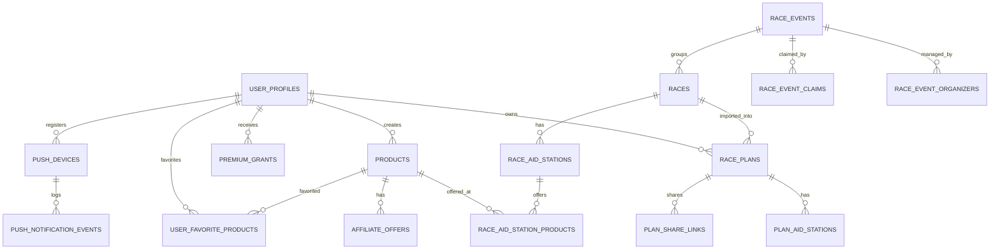

# Schema Overview

## Purpose

This document summarizes the Supabase Postgres schema as inferred from migrations and current code. Prefer `supabase/migrations/*.sql` over archived schema files when changing database behavior.

## Key Concepts

- Owner table: a table whose rows are tied to `auth.uid()`.
- Catalog race: a public or private row in `races`.
- Saved plan: a row in `race_plans` with flexible planner JSON.
- Plan share link: a public crew recap snapshot tied to a saved plan through a hashed token, with narrow crew-side tracking state.
- Plan aid station: per-plan aid station snapshot.
- Race aid station: catalog/private race aid station source, including water, solid, and assistance service flags.
- Organizer membership: event-scoped access through `race_event_organizers`.
- Entitlement source: subscription, trial, or premium grant.

## Tables

| Table | Purpose |
| --- | --- |
| `app_feedback` | Feedback submitted from app surfaces; later migrations add user and tracking fields. |
| `affiliate_click_events` | Service-managed click events for affiliate offers. |
| `affiliate_events` | Authenticated affiliate event tracking such as popup open or click. |
| `affiliate_offers` | Merchant offer links attached to `products`. |
| `app_changelog` | Published mobile app changelog entries. |
| `nutrition_plans` | User-owned nutrition planning snapshots. |
| `plan_aid_stations` | Aid station rows attached to a saved race plan. |
| `plan_share_links` | Public crew recap snapshots and limited crew tracking state for saved plans, looked up by hashed share token. |
| `premium_grants` | Manual premium overrides with optional end dates. |
| `products` | Fuel product catalog and user-created products, with explicit `is_official` metadata for curated/shared catalog rows. |
| `push_devices` | Expo push tokens and device metadata per user. |
| `push_notification_events` | Push reminder send log and dedupe records. |
| `race_aid_station_products` | Products an organizer says are available at source race aid stations. |
| `race_aid_stations` | Aid stations attached to `races`, with service availability flags. |
| `race_event_claims` | User requests to claim management of a `race_events` row, including draft events created for missing organizer submissions. |
| `race_event_organizers` | Approved event-scoped organizer memberships. |
| `race_events` | Event grouping table used by code; creation migration is not visible in this repo. |
| `race_plans` | Saved planner state and imported GPX plan metadata. |
| `race_requests` | Authenticated user requests for races to add. |
| `races` | Current race catalog/private race table, renamed from `race_catalog`. |
| `rate_limit_entries` | DB-backed rate limit counters used by security-sensitive routes. |
| `subscriptions` | Web Stripe and mobile RevenueCat entitlement rows. |
| `user_favorite_products` | User favorites for products. |
| `user_profiles` | App profile, trial fields, defaults, sign-in metrics, and body metrics. |

Removed legacy tables:

- `traces`
- `trace_points`
- `aid_stations`
- `coach_tiers`
- `coach_profiles`
- `coach_coachees`
- `coach_intake_targets`
- `coach_invites`
- `coach_comments`

`supabase/migrations/20250614120000_remove_traces.sql` disables RLS and drops trace-era objects.
`supabase/migrations/20260618145940_remove_coach_features.sql` drops the retired coach/coachee schema, coach-specific columns on `race_plans` and `user_profiles`, and coach RLS branches.

## Major Relationships

## Current Table Detail Docs

- [race_plans](tables/race-plans.md)
- [plan_aid_stations](tables/plan-aid-stations.md)
- [plan_share_links](tables/plan-share-links.md)
- [race_aid_stations](tables/race-aid-stations.md)
- [race_aid_station_products](tables/race-aid-station-products.md)
- [race_events](tables/race-events.md)
- [race_event_claims](tables/race-event-claims.md)
- [race_event_organizers](tables/race-event-organizers.md)
- [products](tables/products.md)
- [user_profiles](tables/user-profiles.md)
- [subscriptions](tables/subscriptions.md)
- [premium_grants](tables/premium-grants.md)

## Known Schema Conflicts

<!-- CONFLICT: archived docs/db/schema.sql uses race_catalog and race_catalog_aid_stations, while current migrations rename these to races and race_aid_stations in supabase/migrations/20260324000000_refactor_race_catalog_to_races.sql. -->

<!-- CONFLICT: code references race_events, races.event_id, races.race_date, races.has_aid_stations, race_aid_stations.needs_review, race_aid_stations.last_gpx_import_at, and plan_aid_stations.race_aid_station_id, but the visible migrations in this repo do not create all of those tables/columns. Verify against the live Supabase schema before writing migrations that depend on them. -->

## Gotchas

- Do not use `docs/_archive/db/schema.sql` as current truth.
- RLS is enabled on the main app tables; tests and server routes must be explicit about role context.
- Some admin policies in older migrations still reference `user_metadata`; new policies must use `app_metadata`, profile role, or service role patterns.
- `planner_values` is JSONB and intentionally broad; schema docs cannot enumerate all app-level planner fields.
- Mobile catalog root actions are UI-only; keep create/request/help/feedback menu wiring separate from the `race_events` and `races` query contract documented here.
- Mobile catalog and onboarding can share race-event presentation components, but those components must not change the `race_events` and `races` query contract documented here.
- `products.created_by` is ownership only. Official/shared catalog status is explicit in `products.is_official`; do not reintroduce `created_by is null` heuristics in new code.
- Organizer access to claimed public races is stored in `race_event_organizers`, not `races.created_by`.
- Organizer manual claims can create non-live `race_events` draft rows before approval; do not expose those rows as live catalog entries by default.
- Organizer station products are source suggestions. Imported runner plans store them in planner JSON separately from auto-fill supplies.
- Shared product catalog data migrations should preserve the `products` schema contract by setting official metadata (`is_official`, `official_name`) instead of changing visibility or ownership semantics.
- Shared catalog product image backfills should update `products.image_url` only for curated catalog rows and keep ownership/visibility fields unchanged.
- Public plan recap links store a bounded JSON snapshot plus limited `crew_state` in `plan_share_links`; raw URL tokens are not stored, only SHA-256 hashes.
- The legacy coach/coachee feature is retired. Do not reintroduce `coach_*` tables, coach RLS, or coach entitlement columns without a new product decision and migration plan.

## Related Docs

- [Relationships](relationships.md)
- [RLS Policies](rls-policies.md)
- [Migrations](migrations.md)
- [Plan Storage](../03-business-rules/plan-storage.md)
- [Organizer Race Management](../03-business-rules/organizer-race-management.md)
