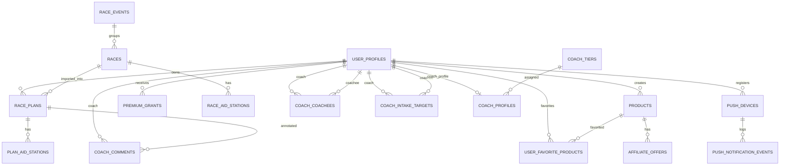

# Schema Overview

## Purpose

This document summarizes the Supabase Postgres schema as inferred from migrations and current code. Prefer `supabase/migrations/*.sql` over archived schema files when changing database behavior.

## Key Concepts

- Owner table: a table whose rows are tied to `auth.uid()`.
- Catalog race: a public or private row in `races`.
- Saved plan: a row in `race_plans` with flexible planner JSON.
- Plan aid station: per-plan aid station snapshot.
- Race aid station: catalog/private race aid station source.
- Entitlement source: subscription, trial, coach profile, or premium grant.

## Tables

| Table | Purpose |
| --- | --- |
| `app_feedback` | Feedback submitted from app surfaces; later migrations add user and tracking fields. |
| `affiliate_click_events` | Service-managed click events for affiliate offers. |
| `affiliate_events` | Authenticated affiliate event tracking such as popup open or click. |
| `affiliate_offers` | Merchant offer links attached to `products`. |
| `app_changelog` | Published mobile app changelog entries. |
| `coach_coachees` | Active or pending coach/coachee relationships. |
| `coach_comments` | Coach annotations on plans, sections, or aid stations. |
| `coach_intake_targets` | Coach-defined nutrition targets for a coachee. |
| `coach_invites` | Email invites from coaches to prospective coachees. |
| `coach_profiles` | Billing and tier metadata for coach accounts. |
| `coach_tiers` | Coach plan limits and entitlement capabilities. |
| `nutrition_plans` | User-owned nutrition planning snapshots. |
| `plan_aid_stations` | Aid station rows attached to a saved race plan. |
| `premium_grants` | Manual premium overrides with optional end dates. |
| `products` | Fuel product catalog and user-created products. |
| `push_devices` | Expo push tokens and device metadata per user. |
| `push_notification_events` | Push reminder send log and dedupe records. |
| `race_aid_stations` | Aid stations attached to `races`. |
| `race_events` | Event grouping table used by code; creation migration is not visible in this repo. |
| `race_plans` | Saved planner state and imported GPX plan metadata. |
| `race_requests` | Authenticated user requests for races to add. |
| `races` | Current race catalog/private race table, renamed from `race_catalog`. |
| `rate_limit_entries` | DB-backed rate limit counters used by security-sensitive routes. |
| `subscriptions` | Web Stripe and mobile RevenueCat entitlement rows. |
| `user_favorite_products` | User favorites for products. |
| `user_profiles` | App profile, trial fields, coach flags, defaults, and body metrics. |

Removed legacy tables:

- `traces`
- `trace_points`
- `aid_stations`

`supabase/migrations/20250614120000_remove_traces.sql` disables RLS and drops trace-era objects.

## Major Relationships

## Current Table Detail Docs

- [race_plans](tables/race-plans.md)
- [plan_aid_stations](tables/plan-aid-stations.md)
- [race_aid_stations](tables/race-aid-stations.md)
- [race_events](tables/race-events.md)
- [products](tables/products.md)
- [user_profiles](tables/user-profiles.md)
- [subscriptions](tables/subscriptions.md)
- [premium_grants](tables/premium-grants.md)

## Known Schema Conflicts

<!-- CONFLICT: archived docs/db/schema.sql uses race_catalog and race_catalog_aid_stations, while current migrations rename these to races and race_aid_stations in supabase/migrations/20260324000000_refactor_race_catalog_to_races.sql. -->

<!-- CONFLICT: code references race_events, races.event_id, races.race_date, races.has_aid_stations, race_aid_stations.needs_review, race_aid_stations.last_gpx_import_at, and plan_aid_stations.race_aid_station_id, but the visible migrations in this repo do not create all of those tables/columns. Verify against the live Supabase schema before writing migrations that depend on them. -->

## Gotchas

- Do not use `docs/_archive/db/schema.sql` as current truth.
- RLS is enabled on the main app tables; tests and server routes must be explicit about role context.
- Some admin policies in older migrations still reference `user_metadata`; new policies must use `app_metadata`, profile role, or service role patterns.
- `planner_values` is JSONB and intentionally broad; schema docs cannot enumerate all app-level planner fields.
- Mobile catalog root actions are UI-only; keep create/request/help/feedback menu wiring separate from the `race_events` and `races` query contract documented here.

## Related Docs

- [Relationships](relationships.md)
- [RLS Policies](rls-policies.md)
- [Migrations](migrations.md)
- [Plan Storage](../03-business-rules/plan-storage.md)
